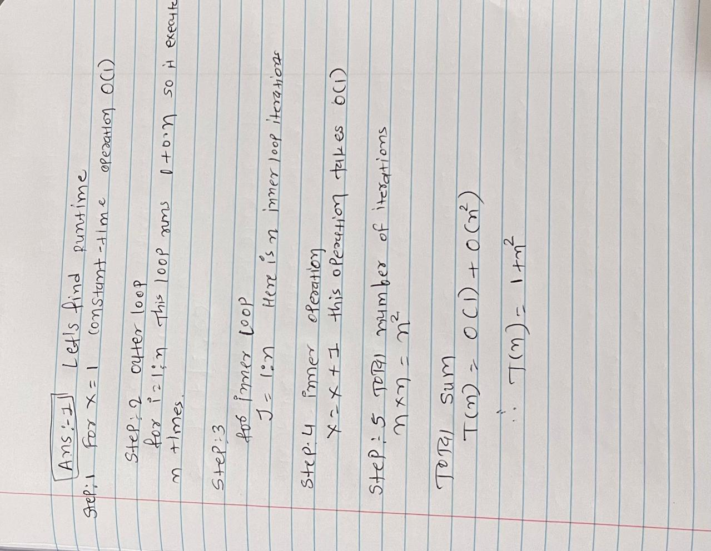
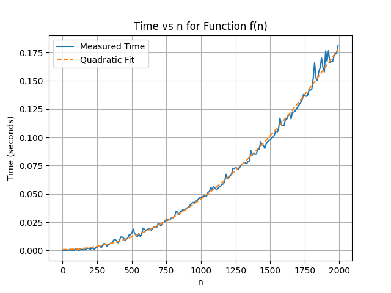
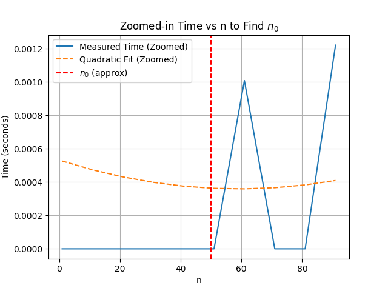

# Hands-On 3

function x = f(n) 
   x = 1; 
   for i = 1:n 
        for j = 1:n 
             x = x + 1; 

1) Find the runtime of the algorithm mathematically.
 

2) Time this function for various n e.g. n = 1,2,3.... You should have small values of n all the way up to large values. Plot "time" vs "n" (time on y-axis and n on x-axis). Also, fit a curve to your data, hint it's a polynomial. 
**ANS 2**
 

3) Find polynomials that are upper and lower bounds on your curve from #2. From this specify a big-O, a big-Omega, and what big-theta is.
**ANS 3**
Big-O: 𝑂(𝑛^2 ),which means the upper bound of the algorithm is quadratic. 
Big-Omega: Ω(𝑛^2),meaning the lower bound is also quadratic. 
Big-Theta: Θ(𝑛^2),meaning the runtime is exactly 𝑛^2. 
**ANS 4**
4) Find the approximate (eye ball it) location of "n_0" . Do this by zooming in on your plot and indicating on the plot where n_0 is and why you picked this value. Hint: I should see data that does not follow the trend of the polynomial you determined in #2. 

* Why n_0=50? 
For 𝑛 < 50,the measured times closely follow the quadratic fit. 
After 𝑛 0 = 50 n 0 ​ =50, there is noticeable fluctuation and deviation in the measured runtime. 

# If I modified the function to be: 
x = f(n) 
   x = 1; 
   y = 1; 
   for i = 1:n 
        for j = 1:n 
             x = x + 1; 
        y = i + j; 

4) Will this increate how long it takes the algorithm to run (e.x. you are timing the function like in #2)? 
**ANS 4** 
Adding the line y = i + j; will not change the overall time complexity. The operation y = i + j; is still O(1) and runs inside the nested loops, so the number of operations remains n^2 .

5) Will it effect your results from #1? 
Not a remarkable effect as adding one summation line will not increase significant time as it take constant time O(1).

It does not generate a remarkable effect. Adding one summation line will not significantly increase time, as it takes constant time O(1).