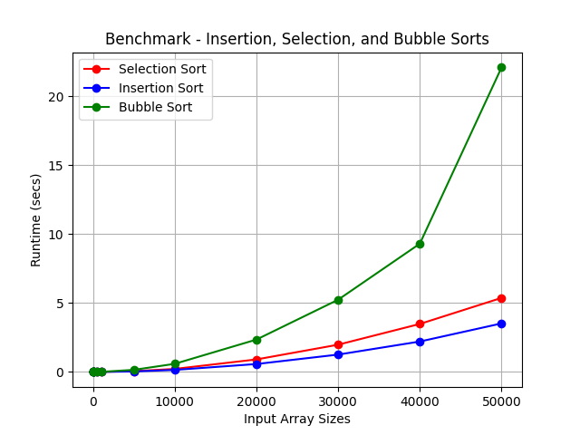

# DAA
DAA assignments
# Student Id : 1002223241

## Hands_On 2

Details Of Hands On 2 Assignment

# Here is my system information:

* OS Name	Microsoft Windows 11 Home Single Language
* Version	10.0.22631 Build 22631
* Processor	Intel(R) Core(TM) i5-8265U CPU @ 1.60GHz   1.80 GHz.
* Installed RAM	8.00 GB (7.82 GB usable).
* System type	64-bit operating system, x64-based processor.
* Pen and touch	No pen or touch input is available for this display.

# 1 benchmarking for Insertion sort :
* I took input of Random number between 0 and 999.
* I took input sizes from 5,10,20...upto 50000.
* input_sizes = [5, 10, 20, 50, 100, 500, 1000, 5000,10000,20000,30000,40000,50000]
* time_taken_by_algo = [2e-07,5e-07,1.3e-06,4.5e-06,2.22e-05,0.0004893,0.0017502,0.0369939,0.146127,0.572828,1.25735,2.20588,3.51983];

# 2 benchmarking for Selection sort:
* I took input of Random number between 0 and 999.
* I took input sizes from 5,10,20...upto 50000.
* input_sizes = [5, 10, 20, 50, 100, 500, 1000, 5000,10000,20000,30000,40000,50000]
* time_taken_by_algo = [5e-07,1.3e-06,2.2e-06,9.5e-06,3.08e-05,0.000627,0.0023517,0.0569425,0.217667,0.90598,1.97542,3.48149,5.37219]

# 3 benchmarking for Bubble sort :
* I took input of Random number between 0 and 999.
* I took input sizes from 5,10,20...upto 30000.
* input_sizes = [5, 10, 20, 50, 100, 500, 1000, 5000,10000,20000,30000,40000,50000]
* time_taken_by_algo = [8e-07, 2.2e-06,2.6e-06, 1.45e-05, 6.66e-05, 0.001408, 0.0057132, 0.150659,0.585995,2.34572,5.23766,9.30433,22.0952];

# Benchmark All Algorithms File
* I used a C++ library called Chrono to calculate the algorithm's time for different input sizes, and I also used Cstdlib to generate input randomly.
* Python File For plot Input Vs Time
[plot time vs input](plot_time_vs_input.ipynb)

# Selection Sort Correctness Argument
To prove that the selection sort algorithm working correct we can use the concept of a loop invariant. loop invariant is a condition that is true before and after each iteration.
 For selection sort, we can define the loop invariant as:
at the start of the i th iteration, the portion of the array before index i is sorted and every element in this portion is less than or equal to all elements in the unsorted portion arr[i..n-1].
# Proof of Correctness:
1. Initialization:
before any iterations occur the sorted portion of the array is empty Therefore, the loop invariant The holds trivially.
2. Maintenance:
 at each iteration, the algorithm identifies the smallest element in the unsorted part of the array and swaps it with the first element of the unsorted part. this will make sure that  after each swap the element at position i is in its correct position.
 after this swap the portion of the array up to i is sorted as the smallest element from the remaining unsorted section has been moved to its correct place. The remaining unsorted portion still satisfies the  loop invariant.
3. Termination:
 	when the loop finishes the entire array has been processed, and the invariant tells us that the entire array is now sorted.
# Time Complexity:
 Worst-case and best-case: The algorithm always performs O(n^2) comparisons and swaps because it goes through the entire array for each element, even if the array is already sorted.
space complexity : O(1), as the algorithm performs the sorting in place without requiring additional space.
by following the above steps of initialization, maintenance, and termination, we can see that selection sort is guaranteed to work correctly.

## Hands_On 3

Details Of Hands On 3 Assignment

* All Details About Assignment 3 is inside this file
[`handsOn-3.md`](Hands-On-3/handsOn-3.md) 

* Python File For Time Vs N input[`time_vs_N`](Hands-On-3/time_vs_n.ipynb)
* Python File For Find the approximate (eye ball it) location of "n_0"[`n_0`](Hands-On-3/n_0.ipynb)

## Hands_On 4

Details Of Hands On 4 Assignment

* All Details About Assignment 3 is inside this file
[`handsOn-4.md`](Hands-On-4/Hands-On-4.md) 

## Hands_On 5

Details Of Hands On 5 Assignment

* All Details About Assignment 5 is inside this file
[`hands-On-5.md`](Hands-On-5/Hands-On-5.md) 

## Hands_On 6

Details Of Hands On 6 Assignment

* All Details About Assignment 6 is inside this file
[`hands-On-6.md`](Hands-On-6/Hands-On-6.md) 

## Hands_On 8

Details Of Hands On 8 Assignment

* All Details About Assignment 8 is inside this file
[`hands-On-8.md`](Hands-On-7/Hands-On-7.md) 

## Hands_On 9

Details Of Hands On 9 Assignment

* All Details About Assignment 9 is inside this file
[`hands-On-9.md`](Hands-On-9/Hash_table/Hands-On-9.md) 

## Hands_On 10

Details Of Hands On 10 Assignment

* All Details About Assignment 10 is inside this file
[`Hands-On-10.md`](/Hands-On-10/Hands-On-10.md) 

## Hands_On 11

Details Of Hands On 11 Assignment

* All Details About Assignment 11 is inside this file
[`Hands-On-11.md`](/Hands-On-11/Hands-On-11.md) 

## Hands_On 13

Details Of Hands On 13 Assignment

* All Details About Assignment 13 is inside this file
[`Hands-On-13.md`](/Hands-On-13/Hands-On-13.md)

# Hands_On 14

Details Of Hands On 14 Assignment

* All Details About Assignment 14 is inside this file
[`Hands-On-14.md`](/Hands-On-14/Hands-On-14.md)

