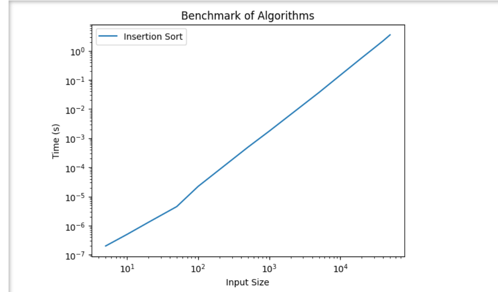
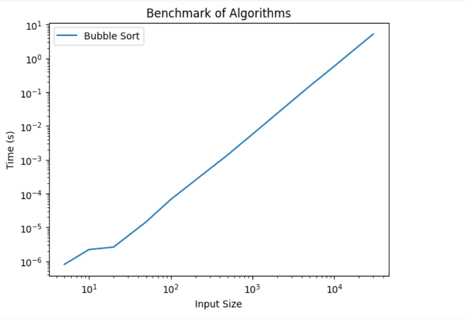

# DAA
DAA assignments

 * Here is my system information:

OS Name	Microsoft Windows 11 Home Single Language
Version	10.0.22631 Build 22631
Processor	Intel(R) Core(TM) i5-8265U CPU @ 1.60GHz   1.80 GHz.
Installed RAM	8.00 GB (7.82 GB usable).
System type	64-bit operating system, x64-based processor.
Pen and touch	No pen or touch input is available for this display.

(1) benchmarking for Insertion sort :
 I took input of Random number between 0 and 999.
 I took input sizes from 5,10,20...upto 50000.
input_sizes = [5, 10, 20, 50, 100, 500, 1000, 5000,10000,20000,30000,40000,50000]
times_algo = [2e-07,5e-07,1.3e-06,4.5e-06,2.22e-05,0.0004893,0.0017502,0.0369939,0.146127,0.572828,1.25735,2.20588,3.51983];

(2)
benchmarking for Selection sort:

I took input of Random number between 0 and 999.
I took input sizes from 5,10,20...upto 50000.
input_sizes = [5, 10, 20, 50, 100, 500, 1000, 5000,10000,20000,30000,40000,50000]
times_algo = [5e-07,1.3e-06,2.2e-06,9.5e-06,3.08e-05,0.000627,0.0023517,0.0569425,0.217667,0.90598,1.97542,3.48149,5.37219]

(3)
benchmarking for Bubble sort :

I took input of Random number between 0 and 999.
 I took input sizes from 5,10,20...upto 30000.
input_sizes = [5, 10, 20, 50, 100, 500, 1000, 5000,10000,20000,30000]
times_algo = [8e-07, 2.2e-06,2.6e-06, 1.45e-05, 6.66e-05, 0.001408, 0.0057132, 0.150659,0.585995,2.34572,5.23766];

